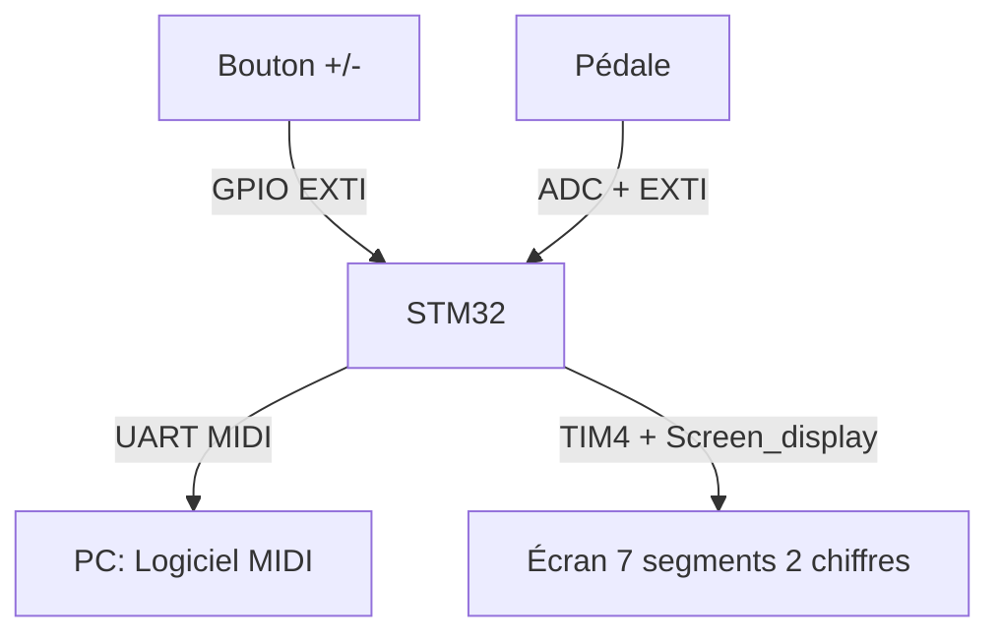
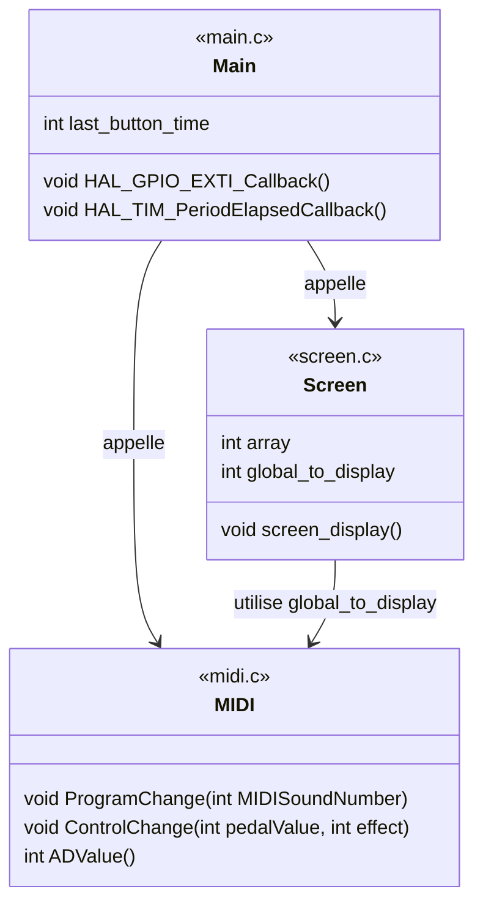
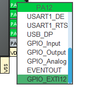
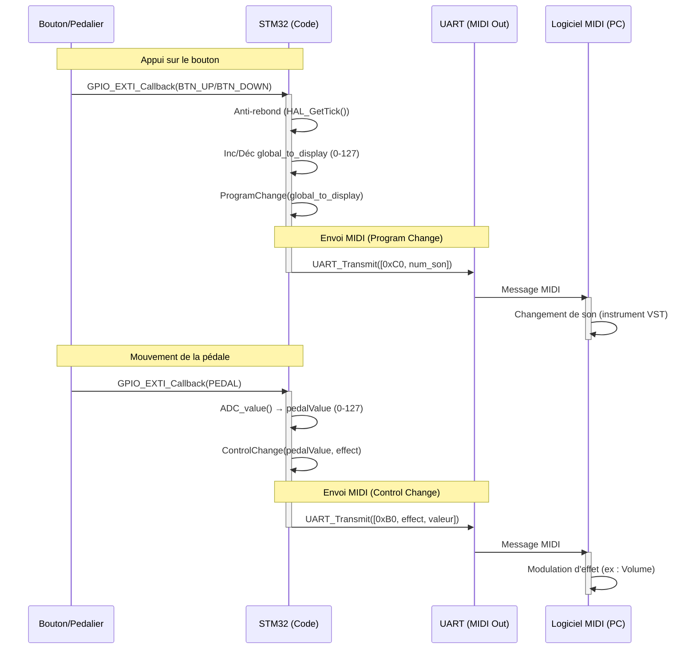

# Projet 1A Pédale MIDI

## Équipe  
- **TURGUT Iprahim**  
- **PREVOST Alexian**  
- **CHERIFI Sacha**

## Description des dossiers 
- Datasheets : 
    * Fichier g21u.pdf : documentation technique du pédalier "Guitar Effects Pedal G2.1u".
    * Fichier NJL5167K.pdf : documentation technique du capteur photoélectrique.
    * Fichier DTA123JCAHZGT116 : documentation technique du transistor.
- Hardware :
    * On retrouve ici la schématique du projet réalisé sur le logiciel Kicad.
- Software :
    * Emplacement de la partie programmation sur le logiciel STM32CubeIde. 


## I / PARTIE HARDWARE

### Architecture Générale

Le système repose sur une carte STM32 qui centralise la lecture des entrées (pédale, boutons), l’affichage 7 segments, et la transmission MIDI via UART. L’ensemble est alimenté en **3,3 V**, régulé à partir d’une source **+5 V**.

---

### Schéma Électronique

Le schéma du projet a été réalisé sur **KiCad**. Il comprend :

- **Unité centrale** : STM32G431KBTx
- **Conditionnement du signal de pédale** via AOP
- **Commande des LED 7 segments** avec transistors PNP à résistances intégrées
- **Régulation d’alimentation 5V → 3.3V**
- **Connecteurs** : connecteur STDC14 entrées boutons, affichage LED, communication série

---

### Détail des blocs matériels

#### 1. Microcontrôleur
- **Référence** : STM32G431KBTx  
- **Architecture** : ARM Cortex-M4, fréquence max 170 MHz  
- **Format** : LQFP-32  
- **Périphériques utilisés** :
  - **ADC1** pour lire la tension envoyée par la pédale (valeur analogique)
  - **GPIOs** pour lire l'état des boutons UP/DOWN
  - **EXTI** pour gérer les interruptions sur appuis bouton / pédale
  - **USART1 (UART)** pour la communication MIDI (sortie TX)
  - **TIM4** pour gérer le multiplexage de l'affichage 7 segments (interruption périodique)
- **Alimentation** : 3.3V régulée par LDO
- **Avantages** :
  - Microcontrôleur puissant et polyvalent
  - Intégration de nombreuses fonctionnalités sur un boîtier compact

#### 2. Alimentation
- **Composant principal** : BU33SD5WG-TR (Régulateur LDO)
- **Entrée** : +5V (via connecteur J5)
- **Sortie** : +3.3V (pour alimenter le microcontrôleur, les transistors, l’AOP)
- **Protection / filtrage** :
  - **Condensateurs** d’entrée et de sortie (1 µF chacun)
  - **LED** de visualisation d'alimentation (D1)
- **Pourquoi ce choix ?**
  - Faible dropout voltage
  - Très faible consommation de repos
  - Format compact (SOT-23-5)

#### 3. Entrée analogique – Pédale d’expression
- **Signal d’entrée** : tension analogique entre 0 V et 3.3 V issue d’un capteur optique (NJL5167K)
- **Conditionnement du signal** :
  - Utilisation d’un double AOP : **MCP6002**
    - Canal 1 : buffer (impédance d’entrée élevée, stabilité)
    - Canal 2 : amplificateur non-inverseur (gain défini par R6/R4)
  - **Potentiomètre (RV1 = 470 Ω)** pour réglage fin du gain ou de la tension de référence
  - **Filtrage** : R et C en entrée pour atténuer les perturbations haute fréquence
- **Pourquoi ce choix ?**
  - MCP6002 est un AOP **rail-to-rail**, faible consommation, économique
  - Compatible avec alimentation 3.3V

#### 4. Affichage LED 7 segments
- **Nombre de chiffres** : 2 chiffres (double afficheur)
- **Commande** :
  - **Multiplexage** : affichage alterné via interruptions du TIM4
  - **Segments (a–g)** câblés en parallèle sur un port GPIO (ex: GPIOB)
  - **Anodes communes** : activées alternativement via 2 transistors
- **Transistors utilisés** :
  - **DTA123J** (Q1, Q2)
    - Transistors PNP avec résistances intégrées (R1 = 2.2 kΩ, R2 = 47 kΩ)
    - Pilotés par le microcontrôleur (commutation rapide, faible encombrement)
- **Pourquoi ce choix ?**
  - Réduction du nombre de broches GPIO (affichage multiplexé)
  - Meilleure lisibilité pour l’utilisateur
  - Moins de composants passifs nécessaires grâce aux transistors "pré-polarisés"

#### 5. Entrées utilisateur – Boutons poussoirs
- **Boutons** :
  - UP (J6) et DOWN (J6)
  - Pull-down via résistances de 47 kΩ (R7, R8)
  - Connexions sur GPIOs avec **interruptions EXTI**
- **Utilisation** :
  - Sélection de presets MIDI (valeurs entre 0 et 127)
  - Incrémentation / décrémentation de la variable `globalToDisplay`
- **Protection / rebond logiciel** :
  - Anti-rebond logiciel via `HAL_GetTick()` + temporisation 50 ms

#### 6. Communication MIDI
- **Interface** : UART via USART1
- **Niveau logique** : TTL 3.3V (compatible PC ou interface MIDI-USB)
- **Format des messages** :
  - **Program Change** : `[0xC0, num_programme]`
  - **Control Change** : `[0xB0, effet, valeur]`
- **Utilisation** :
  - Envoi vers un PC ou un synthétiseur logiciel
  - Communication unidirectionnelle (TX uniquement)

#### 7. Programmation / Debug
- **Connecteur STDC14 (J3)** :
  - Connexion au programmateur ST-Link
  - Accès aux signaux :
    - SWCLK, SWDIO (programmation/debug)
    - TX_DEBUG, RX_DEBUG (UART secondaire pour impression/log)
- **Pourquoi ce choix ?**
  - Connecteur standard ST utilisé à l’ENSEA
  - Facilité de reprogrammation et débogage en temps réel


### Justification du choix des composants

| Composant           | Rôle                    | Justification                                           |
|---------------------|-------------------------|---------------------------------------------------------|
| STM32G431KBTx       | Contrôle principal       | Compatibilité ADC, UART, TIM, GPIO. Format compact.     |
| MCP6002             | AOP pour pédale          | Rail-to-rail, faible consommation, économique.          |
| DTA123J             | Commutation LED          | Transistors PNP avec résistances intégrées → gain de place. |
| BU33SD5WG           | Régulateur               | Régulation stable 3.3V, faible chute de tension.        |
| RV1 (470 Ω)         | Réglage de gain          | Permet un calibrage manuel de la pédale.                |
| Affichage 7 segments| Retour visuel utilisateur| Simple, lisible, facilement multiplexé avec 2 chiffres. |


# II/PARTIE SOFTWARE
# Notions clefs
## **1. DEFINITION DU MIDI**
Le **MIDI** (abréviation de **Musical Instrument Digital Interface**) est un Protocole de communication et un format de fichier destinés à la musique, et utilisés pour la communication entre instruments électroniques, contrôleurs, séquenceurs, et logiciels de musique.
## **2. FORME D'UN MESSAGE MIDI** 

|        Message   |Status | Data1|Data2|
|----------------|-------------------------------|----------------------------|-----------------------------|
|Control Change (CC)|1011 CCCC            |Control number (0-119)            |Value (0-127)|
| Program Change | 1100 CCCC | Program number |N/A |

* **Control Change**
>Envoie un message MIDI pour contrôler un effet ( exemple : le volume , un pédale d'expression , etc )
>> * **Byte de statut (`status`)**
>>  De la forme `0xBn` :
>>`B` indique qu’il s’agit d’un message Control Change 
>>`n` indique le numéro du canal MIDI ( de 0 à 15 soit les channels MIDI de 1 à 16 ).
>>Dans notre cas, le **byte de statut** sera toujours égal à `0xB0`, car `B` indique un message de type **Control Change**, et nous utilisons arbitrairement le **canal 0**, qui correspond au **canal MIDI 1**.
>
>> * **Byte de la premiere donnée (`data1`)**
>> data1 est le numéro du contrôleur c'est à dire l'effet appliqué ( de 0 à 127 ). 
>
>> * **Byte de la deuxième donnée (`data2`)**
>data 2 est la valeur du contrôleur c'est à dire la valeur de l'effet souhaité ( de 0 à 127 ). 
>
>***Exemple pratique**: On veut envoyer une message Control Change sur le cannal MIDI 1 de manière à mettre le volume le plus fort possible. On prendra  :
>Message = [0xB0, 7, 127]*

* **Program Change**
>Envoie un message MIDI pour changer de preset ou d'instrument VST.
>> * **Byte de statut (`status`)**
>>  De la forme `0xCn` :
>>`C` indique qu’il s’agit d’un message Program Change 
>>`n` indique le numéro du canal MIDI ( de 0 à 15 soit les channels MIDI de 1 à 16 ).
>>Dans notre cas, le **byte de statut** sera toujours égal à `0xC0`, car `C` indique un message de type **Control Change**, et nous utilisons arbitrairement le **canal 0**, qui correspond au **canal MIDI 1**.
>
>> * **Byte de la premiere donnée (`data1`)**
>> data1 est le numéro du programme c'est à dire le preset ou l'instrument ( de 0 à 127 ). 
>
>> * **Byte de la deuxième donnée (`data2`)**
>data2 n'est **pas utilisée.**
>
>***Exemple pratique**: On veut envoyer une message Program Change sur le cannal MIDI 1 de manière à utiliser un son de piano ( 0 pour un Acoustic Grand Piano dans la banque de sons MIDI ) . On prendra alors:
>Message = [0xC0, 0]*
>


# Objectifs  de programmation
## **1. Interaction entre la STM32, les périphériques d’entrée et le système MIDI**

## **2. Les élements à coder**
 * **Ecran 7 cadrants 2 chiffres**
>Affiche le numéro du son sélectionné dans la banque MIDI.  
Ce numéro est mis à jour selon l’appui sur les boutons **UP** ou **DOWN**.  
L’écran offre un retour visuel clair à l’utilisateur.
>
* **Boutons de selection des sons**
>Permettent de naviguer dans la banque de sons MIDI (de 0 à 127).  
Chaque appui incrémente ou décrémente le numéro de programme.
>
 * **Pedale**
>Connectée à l’**entrée ADC**, elle mesure une tension analogique.  
Sa valeur est convertie en valeur MIDI (0–127).  
Elle permet un **contrôle en temps réel** d’un paramètre MIDI (volume, sustain, etc).
>
 * **Communication MIDI**
>La STM32 envoie les messages MIDI via **UART**.  
Elle transmet les changements de sons ou de contrôle vers un PC.
La STM32 agit comme **contrôleur MIDI autonome**.

# **Code et projet**
## **1. Agencement du projet dans STM32CubeIDE**

## **2. Le code et explications détaillées**
**Contenu du midi.c :** 
* **Fonction ControlChange**
```
void  ControlChange(int pedalValue, int effect)
{
int message[3] = {0xB0, effect, pedalValue}; 
HAL_UART_Transmit(&huart1, message, 3, HAL_MAX_DELAY);
}
```
>--- ***Pourquoi cette fonction ?*** ---
>Un **Control Change** permet de **modifier des paramètres en temps réel**, comme le volume.
> * `message[3]` est un tableau de 3 octets, correspondant à un message **MIDI Control Change**. Ici, le message MIDI signifie :  *"Change la valeur de l'`effect` voulu sur le canal MIDI 1 avec la valeur `pedalValue`."*
>* La fonction `HAL_UART_Transmit` envoie ce message via la liaison **série UART**.

* **Fonction ProgramChange**
```
void ProgramChange(int MIDISoundNumber)
{
int message[2] = {0xC0, MIDISoundNumber};
HAL_UART_Transmit(&huart1, data, 2, HAL_MAX_DELAY);
}
```
>--- ***Pourquoi cette fonction ?*** ---
>Un **Program Change** permet de **changer le son ou le preset** utilisé par  l'instrument.
> * `message[2]` est un tableau de 2 octets, correspondant à un message **MIDI Program Change**. Ici, le message MIDI signifie :  *"Change le programme (son) de l'instrument sur le canal 1 pour le programme `MIDISoundNumber`."*
>* La fonction `HAL_UART_Transmit` envoie ce message via la liaison **série UART**.

* **Fonction  pour le potentiometre (valeur ADC)**
``` 
uint8_t ADCValue(void)
{
uint12_t adcValue = HAL_ADC_GetValue(&hadc1);
return (uint8_t)((adcValue * 127) / 4095);
}
```
>--- ***Pourquoi cette fonction ?*** ---
> Un **ADC** (Analog-to-Digital Converter) permet de convertir une **tension analogique** (par exemple entre **0V et 3.3V**) en une **valeur numérique** exploitable par un microcontrôleur.  
Si l’ADC est en **résolution 12 bits**, il produit des valeurs comprises entre **0 et 4095**. Or, dans le protocole **MIDI**, les données comme les valeurs de contrôle sont codées sur **7 bits**, c’est-à-dire de **0 à 127**.
Ainsi, pour utiliser une valeur provenant de l’ADC dans un message MIDI, il est nécessaire de convertir la plage **0–4095** vers la plage **0–127**.
>* `HAL_ADC_GetValue(&hadc1)` lit la dernière **valeur convertie par l’ADC**.
>`adcValue` sera une valeur comprise entre **0 et 4095** (12 bits).
>
> * `(uint8_t)((adcValue * 127) / 4095)` **convertit** la valeur 12 bits (0–4095) en 7 bits (0–127), proportionnellement  et le **cast** en `(uint8_t)` assure que la valeur retournée est bien entre 0 et 127.

**Contenu du midi.h :** 

**Contenu du screen.c :** 
* **Multiplexage pour l'affichage de l'écran 7 cadrants**
```
extern  int globalToDisplay;

//CATHODE COMMUNE
const  uint8_t array[10] =
{
0b00111111, // 0
0b00000110, // 1
0b01011011, // 2
0b01001111, // 3
0b01100110, // 4
0b01101101, // 5
0b01111101, // 6
0b00000111, // 7
0b01111111, // 8
0b01101111 // 9
};

void  screenDisplay(void) 
{
static  int displayNumber = 0;
if (displayNumber == 0) 
	{
	GPIOB->ODR = array[globalToDisplay / 10];
	HAL_GPIO_WritePin(GPIOA, GPIO_PIN_0, GPIO_PIN_SET); // COM0 = 1
	HAL_GPIO_WritePin(GPIOA, GPIO_PIN_1, GPIO_PIN_RESET); // COM1 = 0
} 

else
	{
	GPIOB->ODR = array[globalToDisplay % 10]; 
	HAL_GPIO_WritePin(GPIOA, GPIO_PIN_0, GPIO_PIN_RESET); // COM0 = 0
	HAL_GPIO_WritePin(GPIOA, GPIO_PIN_1, GPIO_PIN_SET); // COM1 = 1
	}
	displayNumber = 1 - displayNumber;
}
```
>--- ***Pourquoi cette fonction ?*** ---
>`screenDisplay()` qui gère l’affichage des deux chiffres d’un écran 7 segments. Grâce au multiplexage, chaque chiffre est allumé alternativement très rapidement, ce qui donne l’illusion qu’ils sont allumés en même temps.
> * `globalToDisplay`contient **le nombre à afficher** (entre 0 et 99).
> * `const uint8_t array[10]` contient les **valeurs binaires** à envoyer aux segments (a–g) du 7 segments pour afficher les chiffres de 0 à 9.
>> Si on doit afficher **le chiffre des dizaines** (` if (displayNumber == 0) `)
> `GPIOB->ODR = array[globalToDisplay / 10];` permet d'afficher le chiffre des dizaines sur l'écran 7 segments. Elle divise la valeur `globalToDisplay` par 10 pour extraire le chiffre des dizaines, puis utilise ce résultat comme index dans le tableau `array` pour récupérer le motif binaire correspondant aux segments à allumer. Ensuite, ce motif est écrit dans le registre `GPIOB->ODR`, ce qui active les bons segments du chiffre sur l'afficheur.
Les commandes :
>`HAL_GPIO_WritePin(GPIOA, GPIO_PIN_0, GPIO_PIN_SET); 
>HAL_GPIO_WritePin(GPIOA, GPIO_PIN_1, GPIO_PIN_RESET); `
Activent le chiffre des dizaines et désactive le chiffre des unités.
>> Si on doit afficher **le chiffre des unités** (`else`)
>  `GPIOB->ODR = array[globalToDisplay % 10];` fait de même que précèdemment pour le chiffre des unités.
Les commandes :
>`HAL_GPIO_WritePin(GPIOA, GPIO_PIN_0, GPIO_PIN_RESET); 
>HAL_GPIO_WritePin(GPIOA, GPIO_PIN_1, GPIO_PIN_SET); `
Activent le chiffre des unités et désactive le chiffre des dizaines.
>* `displayNumber = 1 - displayNumber;`
Alterne la valeur de `displayNumber` entre 0 et 1 à chaque appel. Elle permet de basculer l’affichage entre les deux chiffres du 7 segments pour réaliser le multiplexage.

**Contenu du screen.h :** 

**Contenu du main.c :** 
* **Interruptions et TIMER**
```
int lastButtonTime = 0; 

void  HAL_TIM_PeriodElapsedCallback(TIM_HandleTypeDef *htim) 
{
if (htim->Instance == TIM4)
	{
	screenDisplay();
	}
}

void  HAL_GPIO_EXTI_Callback(int GPIO_Pin)
{
if ((HAL_GetTick() - lastButtonTime) > 50)
	{ 
	switch(GPIO_Pin)
		{
		case BUTTON_UP:
			globalToDisplay++;
			if (globalToDisplay > 127)
				{
				}
			ProgramChange(globalToDisplay);
			break;
			
		case BUTTON_DOWN:
			globalToDisplay--;
			if (globalToDisplay < 0)
				{
				}
			ProgramChange(globalToDisplay);
			break;
			
		case PEDAL:
			ControlChange(ADCValue(), EFFECT);
			break;
			
	 }
	lastButtonTime = HAL_GetTick();
 }
}
```
>--- ***Pourquoi ce code ?*** ---
>Ce code gère **l'affichage de l'écran** et la **gestion des boutons et de la pédale**. Il utilise un **TIM4** pour le multiplexage de l’écran, et des **interruptions GPIO** pour réagir aux appuis boutons et à la pédale.
>* `void HAL_GPIO_EXTI_Callback(int GPIO_Pin)` se déclenche automatiquement lors d’une interruption sur un bouton ou la pédale i.e lors d'un appui d'un des boutons ou de la pédale.
>> Dans le cas ou le bouton d'incrémentation est préssé (`case BUTTON_UP:`):
 On icrémente `globalToDisplay` pour passer au **son suivant** et on envoie un message MIDI **Program Change** via`sendProgramChange(globalToDisplay)`.
 >>Dans le cas ou le bouton d'incrémentation est préssé (`case BUTTON_DOWN:`):
 On décrémente `globalToDisplay` pour passer au **son précédent** et on envoie un message MIDI **Program Change** via`sendProgramChange(globalToDisplay)`.
>>Dans le cas ou la pédale est préssé (`case PEDAL:`):
  On envoie une commande MIDI de type **Control Change** qui modifie la valeur de l'`EFFECT` suivant la valeur de la lecture de l'**ADC** via `ADCValue()`.
 
 
## **3. Paramétrage de la STM32( pin, TIMER, interruptions )**

.
 

## **4. Résumé du fonctionnement SOFTWARE**



